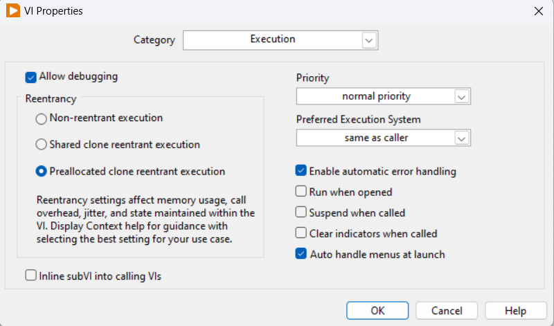

# FRC#8020 Single-Jointed Arm Project

### Subsystem VIs Rules
Subsystem is a componenet of the robot, e.g. Drivetrain, Arm Sytem, Lifting System, Shooting System, etc.

### SubVI Categories
- Framework VIs:   
  This type of VI is for organizing the framework of the robot project. EX. `{SUBSYSTEM}_BEGIN.vi`, `{SUBSYSTEM}_ACT.vi`, `{SUBSYSTEM}_ACQUIRE.vi`, `{SUBSYSTEM}_GLOBALS.vi`, etc.
- Function VIs:  
  This type of VI is for reusable functions for a particular subtask. Go to __File &#187; VI Properties__  Make sure to change the reentrancy option to "Preallocated clone reentrant execution".

### Begin
`{SUBSYSTEM}_BEGIN.vi`: Every subsystems should have an initialization VI in `Begin.vi`. In other words, everything you initialize should be placed in `Begin.vi`.

### Periodic Task
`{SUBSYSTEM}_ACT.vi`: This VI is for the subsystem to __ACT__. In other words, your controller and motor output should be placed here.

(Optional) `{SUBSYSTEM}_ACQUIRE.vi`: If you have sensor data to acquire for your subsystem, put the logic here.

`{SUBSYSTEM}_GLOBALS.vi`: This is the place where you put global variables for your subsystem.
- Please create an GitHub issue if you want to add a global variable. DON'T add global variables yourself.

`{SUBSYSTEM}_DASH_WRITE.vi`: This VI is for any global variables you want to display on NetworkTable. 